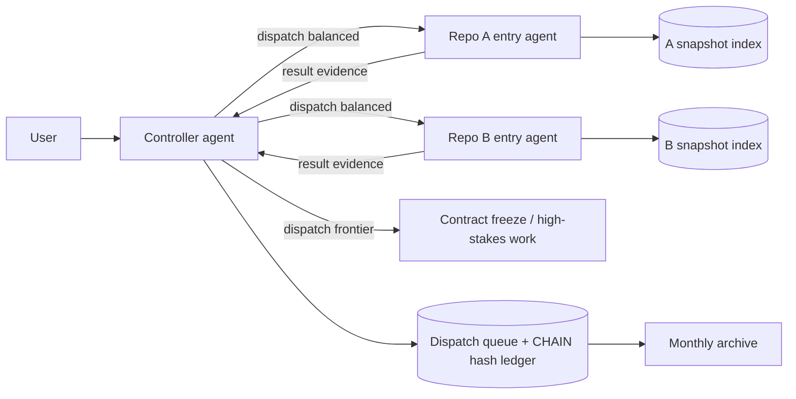

# onboard-dsh-projects

[English](./README.md) | [简体中文](./README.zh-CN.md)

[](./LICENSE)


> **A DeepSeek Harness skill that lets one AI session drive many code repositories — without their contexts bleeding into each other.**

The scariest failure mode in AI-assisted coding isn't a weak model — it's crossed context. Debug a bug across three repos and repo A's instructions leak into repo B's code; you edit the wrong branch, or write somewhere you shouldn't. `onboard-dsh-projects` puts every repository in its own isolated **entry agent**, then adds an optional **controller** to orchestrate the whole effort.

---

## Why it exists

| Pain | What this skill does |
| --- | --- |
| 😵 Context pollution | One isolated entry subagent per repo: instructions, index, evidence, and edits all stay in their own context |
| 🔀 Repo and baseline drift | Verifies root, branch, HEAD, and dirty state before every run; drift blocks, it never silently proceeds |
| 💸 Model and task mismatch | Three-tier model routing: routine work on `v4-flash`, engineering and high-stakes work on `v4-pro` |
| 🔁 Repeating the same mistakes | A bounded experience index: proven strategies are reused, deterministic failures reject the same mechanism |
| 🧠 Controller memory bloat | The controller keeps only cross-project contracts and dispatch state; the ledger is hash-chained and archived, never growing without bound |

**In one line**: when a feature, incident, or release spans multiple repositories with different instructions, branch rules, test commands, or write scopes — this is the skill for it.

## What you get

- ✅ Per repository: one read-only verification → one snapshot index (structure / entrypoints / docs / glossary) → one long-lived entry subagent
- ✅ Optional controller: dispatch queue state machine + hash-chained CHAIN records + three-tier model routing + bounded experience reuse
- ✅ Every piece of state is CAS-hash-verified; mutations must go through a `Read → Prepare → Apply → Read` protocol — no hand edits, no drift
- ✅ Toolchain preflight, closed input parsing (rejects credentials, unsafe refs, duplicate conflicts); fails closed by default

## Architecture



## Quick start (30 seconds)

In a DeepSeek Harness conversation, just say:

```text
Use onboard-dsh-projects.

sources:
- source: C:\work\service-a
- source: C:\work\web-app
indexMode: full
```

For cross-project work, add the controller:

```text
Use onboard-dsh-projects.

sources:
- source: C:\work\service-a
- source: C:\work\web-app
controllerRoot: <absolute path inside the workspace>
initializeController: true
createControllerAgent: true
```

Then hand the problem to the controller in plain language:

```text
Trace the H5 login flow end-to-end across the H5 app, mall backend, and member service.
Read-only first, freeze the shared interface contracts, dispatch checks to each repo's
entry agent, and return end-to-end evidence.
```

## Highlights

- 🧩 **Four-quadrant intake protocol** — shared-known / user-known / agent-known / shared-unknown each get their own handling; no guessing, no interrogation
- 🔒 **Read-only onboarding, writes authorized separately** — external repos are read-only by default; cloning, branch switches, and commits each require explicit authorization
- 🎯 **Model routing** — ships preconfigured for this deployment's real models: `economy` → `deepseek-v4-flash`, `balanced`/`frontier` → `deepseek-v4-pro`; one command to change
- 🧾 **Hash-chained ledger** — one CHAIN per dispatch, line-by-line hash chaining, terminal records archived under `state/archive/YYYY-MM/`; verifiable and traceable
- 🧪 **Tested for real** — every script runs on Windows PowerShell 5.1: preflight, input parsing, indexing, CAS state machine, dispatch queue, chain store; end-to-end integration tests green

## Versus one long session

| Approach | Context and lifecycle | Best for |
| --- | --- | --- |
| One long session | All repos share one ever-growing context | Quick, low-risk checks where rules don't differ |
| This skill | Per-repo entry agents + controller holds only cross-project facts | Cross-repo features, incidents, and releases |

Entry agents can still use subagents and workflows internally — the two compose.

## Honest boundaries

- This is **workflow isolation**, not a security sandbox: it changes no filesystem permissions and never transfers authorizations between repos
- The index is a **snapshot**, not a live view; bindings and indexes are re-verified before cross-session work
- Model routing depends on the models your deployment registers; an unconfigured tier falls back to the session default model

## License

[MIT](./LICENSE)

---

If this project helps you, **give it a Star ⭐** — or send it to a friend who is also fighting multi-repo context pollution. Feedback and PRs are always welcome.
