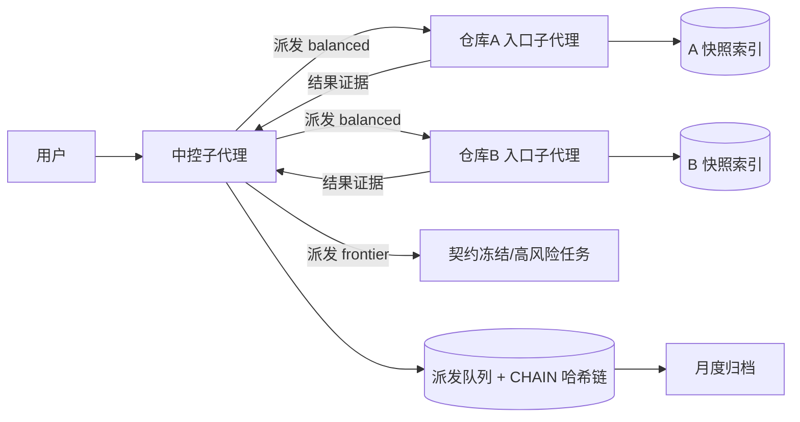

# onboard-dsh-projects

[English](./README.md) | [简体中文](./README.zh-CN.md)

开源仓库：[libaie/onboard-dsh-projects](https://github.com/libaie/onboard-dsh-projects)


> **一个让 DeepSeek Harness 同时驾驭多个代码仓库、却不互相污染上下文的技能。**

用 AI 写代码最怕什么？不是模型不够聪明，而是**上下文串了**——排查一个跨仓库的故障时，A 仓库的规则混进 B 仓库的代码，改了不该改的分支，写进了不该写的地方。`onboard-dsh-projects` 把每个仓库装进它自己的「隔间」，再派一个中控统筹全局。

---

## 为什么需要它

| 痛点 | 本技能的做法 |
| --- | --- |
| 😵 上下文污染 | 每个仓库一个**独立入口子代理**：仓库指令、索引、证据、修改都留在自己的上下文里 |
| 🔀 仓库与基线漂移 | 执行前核验根目录、分支、HEAD、脏工作区；漂移即阻断 |
| 💸 模型与任务不匹配 | **三档模型分层**：常规任务用 `v4-flash`，工程任务与高风险任务用 `v4-pro` |
| 🔁 同样的坑反复踩 | **有界经验索引**：已证明的成功策略直接复用，确定性失败拒绝相同机制 |
| 🧠 中控记忆膨胀 | 中控只保留跨项目契约与派发状态，台账哈希成链、终态自动归档，永不无限增长 |

**一句话**：一个功能、故障或发布横跨多个仓库，且各仓库有不同指令、分支规则、测试命令或写权限时，它就是为这个场景而生。

## 你会得到什么

- ✅ 每个仓库：一次**只读核验** → 一份**快照索引**（结构/入口/文档/术语）→ 一个**常驻入口子代理**
- ✅ 可选**中控**：派发队列状态机 + 哈希链 CHAIN 记录 + 三档模型分层 + 有界经验复用
- ✅ **external-write 泳道**：Jenkins / Nacos / 数据库 / Redis / SSH 等生产变更必须走「能力注册表 + 逐次授权 + 证据门禁 + 回退」，并带无泳道刹车——中控绝不自己下场干运维
- ✅ **强制路由分类**——每个请求先分类再动手：外部系统变更 → external-write 泳道；单仓库工作 → 该仓库入口代理（禁止一次性代理顶替）；跨仓库/契约 → workflow 派发；混合需求拆分后按依赖排序
- ✅ **成本纪律**——分层默认下压（常规任务用 flash）、中控会话按批轮换、大批量派发错峰执行，把上下文缓存开销控制在有界范围
- ✅ **依赖门控**——派发可以声明对先前派发的依赖（可指定允许的终态集合）；不满足时队列拒绝启动，被卡住的队头可取消而不死锁 FIFO
- ✅ **Goal 记账**：在清单中注册/推进/终结目标（`register-goal` / `advance-goal` / `terminal-goal`），可关联一条 CHAIN
- ✅ **权威契约**：SKILL.md 的「Controller / Entry-Agent Contract」章节固化双方的职责、边界与协作顺序——越界即上报，绝不静默绕过
- ✅ 一切状态都有**CAS 哈希校验**，写入必须走 `Read → Prepare → Apply → Read` 协议，杜绝手改和漂移
- ✅ 工具链预检、封闭输入解析（拒绝凭据/危险 ref/重复冲突），安全失败默认关闭

## 架构一览



## 快速开始（30 秒）

在 DeepSeek Harness 对话中直接说：

```text
使用 onboard-dsh-projects。

sources:
- source: C:\work\service-a
- source: C:\work\web-app
indexMode: full
```

跨项目联调再加中控：

```text
使用 onboard-dsh-projects。

sources:
- source: C:\work\service-a
- source: C:\work\web-app
controllerRoot: <工作区内绝对路径>
initializeController: true
createControllerAgent: true
```

然后把问题用自然语言交给中控：

```text
全链路排查 H5 登录流程，涉及 H5、商城后端和会员服务。
先只读排查，冻结共享接口契约，再下发到各仓库入口，回传端到端证据。
```

## 亮点速览

- 🧩 **四象限请求协议**——双方已知/用户已知/agent 已知/双方未知，各走各的处理路径，不瞎猜也不废话
- 🔒 **只读接入，写入单独授权**——外部仓库默认只读；克隆、分支切换、提交都要逐次明确授权，绝不静默越界
- 🎯 **模型分层**——出厂即配 DSH 的两款 DeepSeek 模型：`economy` → `deepseek-v4-flash`，`balanced`/`frontier` → `deepseek-v4-pro`；一键可改（`set-model-tier`）
- 🛡️ **external-write 泳道**——生产变更（Jenkins、Nacos、MySQL、Redis、SSH）绝不允许裸奔：能力注册表 + 逐次授权 + 证据门禁 + 回退步骤
- 🧾 **哈希链台账**——每个派发一条 CHAIN，逐行哈希成链，终态归档到 `state/archive/YYYY-MM/`，可验证、可追溯
- 🧪 **全程实测**——所有脚本在 Windows PowerShell 5.1 实跑通过：预检、输入解析、索引、CAS 状态机、派发队列、链式存储、external-write 与 Goal 操作，端到端集成测试全绿

## 和「一个长会话全做」的区别

| 方式 | 上下文与生命周期 | 适合 |
| --- | --- | --- |
| 单一长会话 | 多仓库共享一个不断膨胀的上下文 | 规则无差异的快速、低风险检查 |
| 本技能 | 每仓独立入口 + 中控只留跨项目信息 | 跨仓库的功能、故障和发布 |

入口子代理内部仍可再用子代理/工作流，两者配合使用。

## 诚实的能力边界

- 这是**工作流隔离**，不是安全沙箱：它不改变文件系统权限，也不会替你在仓库之间转移授权
- 索引是**快照**，不是实时视图；跨会话工作前会先重验绑定与索引
- 模型分层依赖部署注册的模型；未注册的档位自动退回会话默认模型

## 开发说明

- 仓库是唯一事实源。在仓库中修改，再把变更同步到你的 DSH 技能目录（例如 `~/.dsh/skills/onboard-dsh-projects/`）。
- 运行测试：`powershell -NoProfile -ExecutionPolicy Bypass -File ./tests/run-all.ps1`（Windows PowerShell 5.1）。CI 在每次 push 和 PR 上跑同一条命令。
- Windows 注意：测试脚本保持纯 ASCII 或带 BOM 的 UTF-8（PowerShell 5.1 会把无 BOM 的非 ASCII 文件读乱）；仓库通过 `core.autocrlf=true` 统一 CRLF。
- 状态机变更一律走 `tools/control-state.ps1` 的 CAS 协议，禁止手改清单或 CHAIN 文件。

## 协议

[MIT](./LICENSE)

---

如果这个项目对你有用，**给个 Star ⭐**，或者把它转发给同样在多个仓库之间挣扎的朋友。反馈与 PR 永远欢迎。
